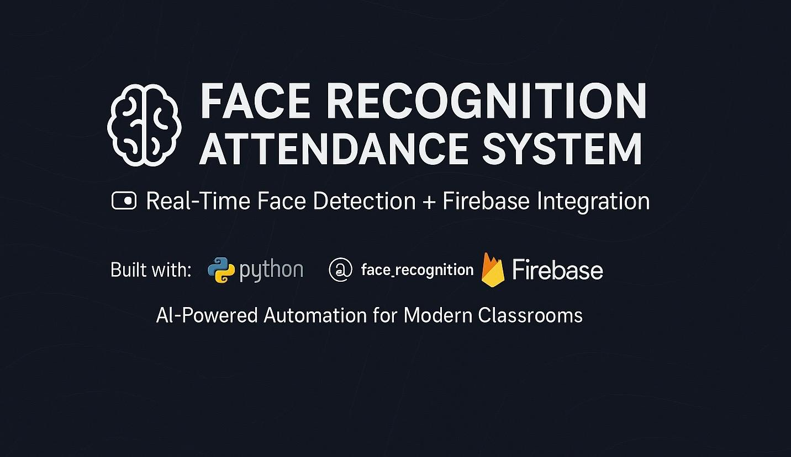

# 🧠 Face Recognition Attendance System


An AI-powered attendance system using **real-time face recognition**, built with Python and Firebase. This project automates student attendance by detecting and recognizing faces through a webcam and recording data in Firebase Realtime Database.

---

## 📸 How It Works

1. **Face Encoding**  
    - Place student images in the `images/` folder.  
    - Each image should be named with the student’s ID (e.g., `452331.jpg`).

2. **Upload Data**  
    - Run `encoder.py` to encode each face and store the encodings in a pickle file.  
    - Images are uploaded to Firebase Cloud Storage.  
    - Use `AddDatatoDatabase.py` to add student details (name, branch, section, etc.) to Firebase Realtime Database.

3. **Recognition & Attendance**  
    - Run `main.py` to start the webcam and detect faces in real time.  
    - If a face is recognized and the last attendance time exceeds a set threshold, the system:  
      - Increments the attendance count  
      - Updates the `last_attendance` timestamp in Firebase

4. **Visual Display**  
    - A custom interface using OpenCV and `cvzone` displays student details and images on the screen.

---

## 🔧 Tech Stack

- **Python 3.7+**
- **OpenCV**
- **face_recognition**
- **Firebase (Realtime Database + Cloud Storage)**
- **cvzone**
- **NumPy**

---

## 🗃️ Project Structure

```
.
├── images/                   # Student face images
├── encodings.p              # Pickle file with encoded face data
├── serviceAccountKey.json   # Firebase service account credentials
├── AddDatatoDatabase.py     # Script to upload student data to Firebase
├── encoder.py               # Script to encode faces and upload images
├── main.py                  # Main script for face recognition and attendance
```

---

## 📥 Installation

### 1. Clone the Repository

```bash
git clone https://github.com/your-username/face-recognition-attendance.git
cd face-recognition-attendance
```

### 2. Install Dependencies

```bash
pip install opencv-python face_recognition firebase-admin cvzone numpy
```

### 3. Firebase Setup

1. Go to the [Firebase Console](https://console.firebase.google.com/)
2. Create a new project
3. Enable:
    - Realtime Database
    - Cloud Storage
4. Generate and download `serviceAccountKey.json`
5. Place it in the root of the project directory
6. Update the Firebase credentials and URLs in:
    - `AddDatatoDatabase.py`
    - `encoder.py`
    - `main.py`

---

## 🚀 Usage

### 1. Add Student Images

Add clear, front-facing images to the `images/` folder.  
**Image name = Student ID** (e.g., `452331.jpg`)

### 2. Encode Faces and Upload to Firebase

```
python encoder.py
```

### 3. Upload Student Info to Database

```
python AddDatatoDatabase.py
```

### 4. Start the Attendance System

```
python main.py
```

---

## ✅ Features

- Real-time face detection using webcam
- Automatic attendance logging with timestamps
- Firebase integration for cloud-based data storage
- Dynamic UI showing student image and details
- Prevents multiple attendance entries within short intervals
- Scalable and adaptable for schools, colleges, and offices

---

## 🧪 Sample Student Data Format

```python
{
  "452331": {
     "name": "Aditya",
     "branch": "CSE-AI",
     "year": "2nd",
     "section": "A",
     "attendance": 4,
     "yearOfJoining": "2022",
     "last_attendance": "2025-10-01 09:00:00"
  }
}
```


---

## 👤 Author

**Aditya Yadav**  
Feel free to connect or contribute!

--

